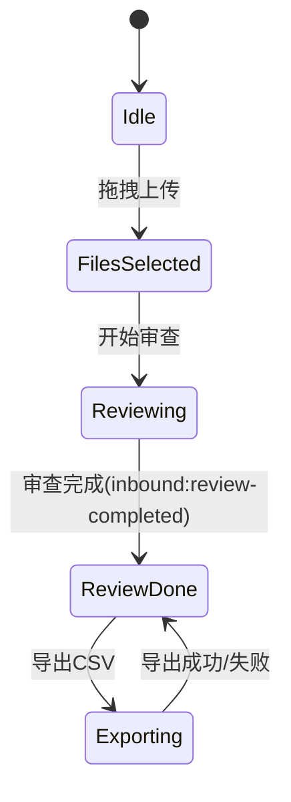
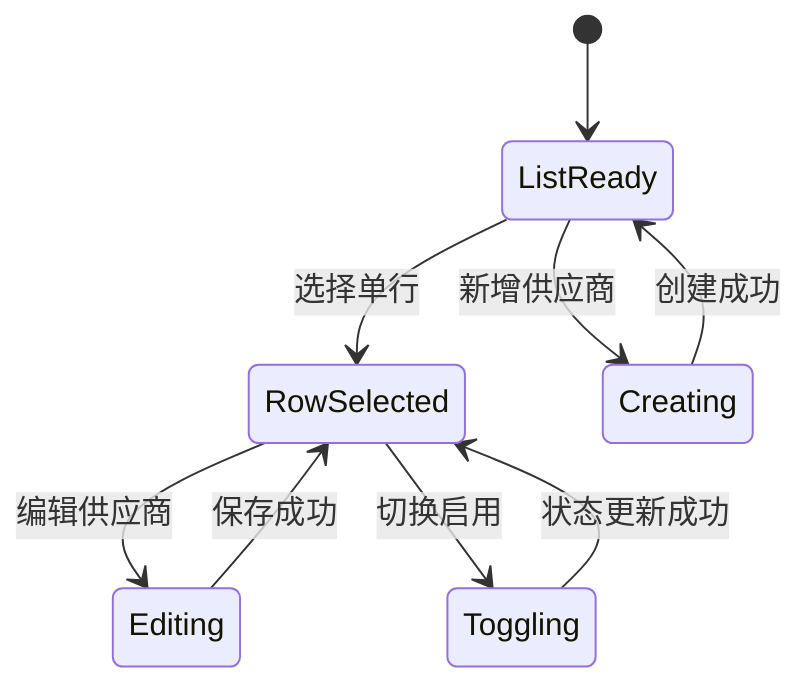
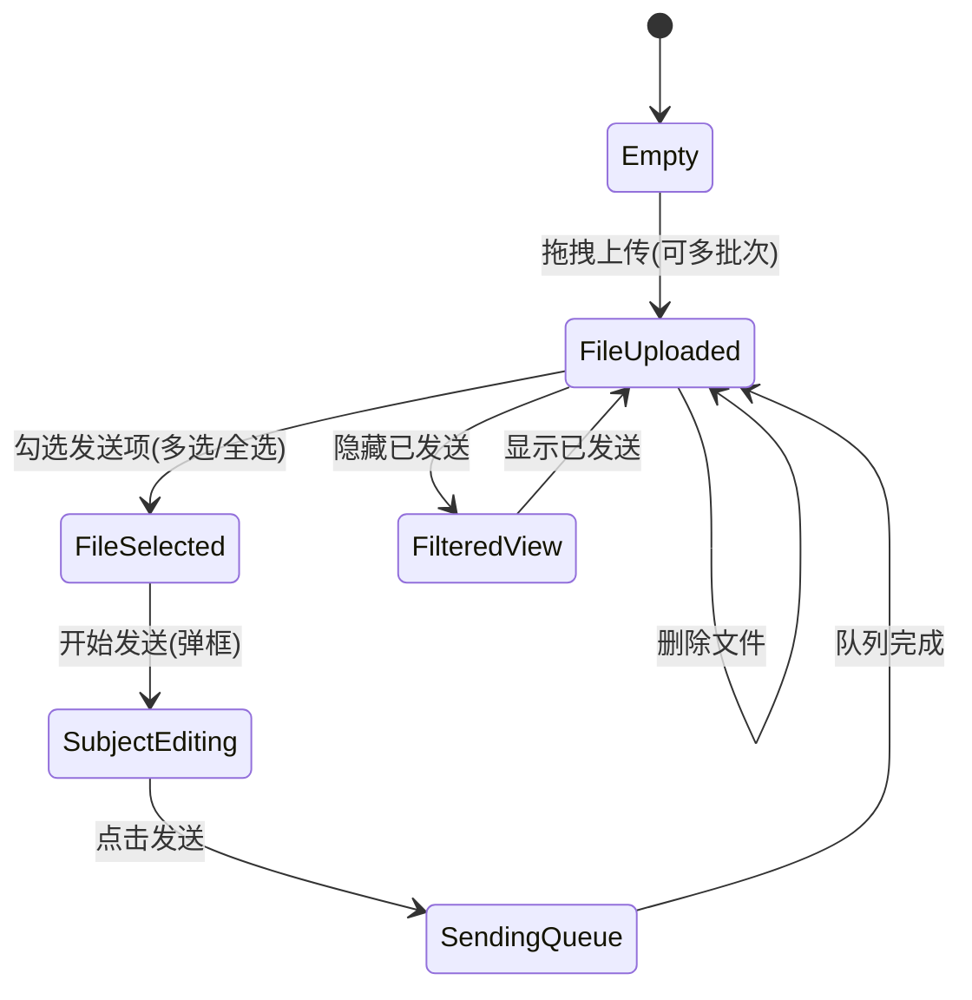
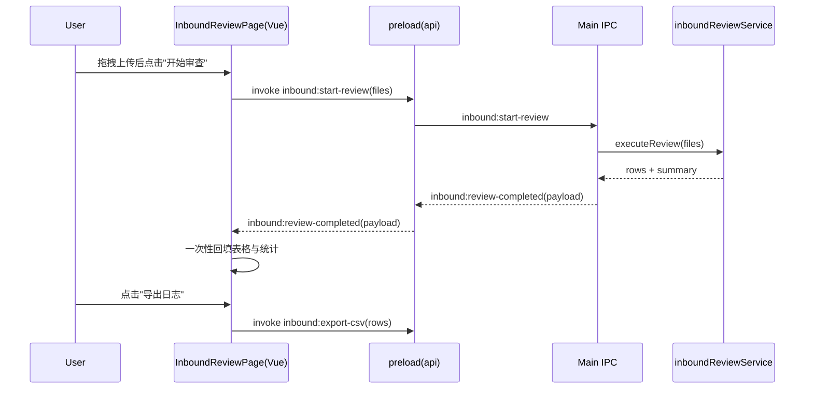
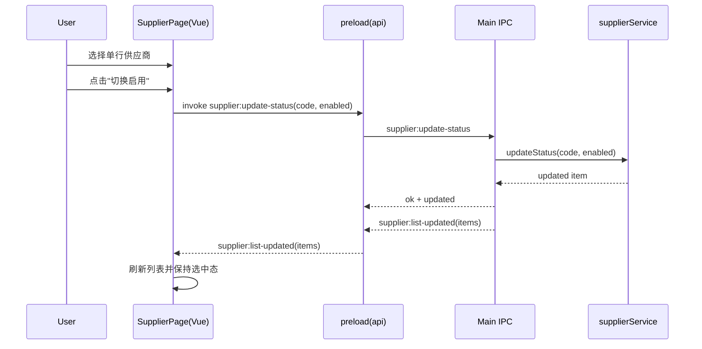
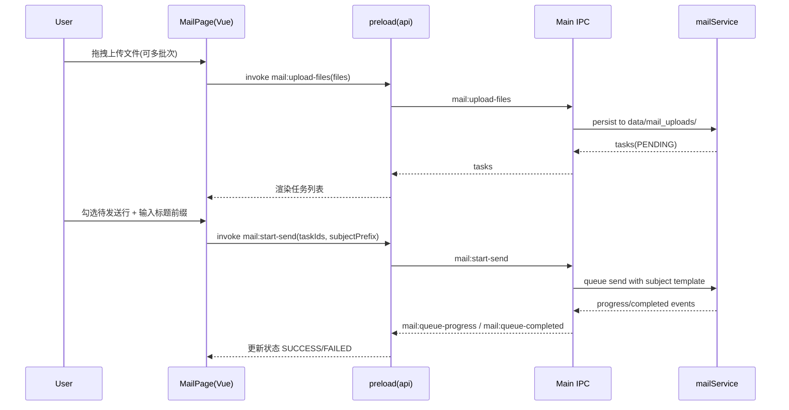

# Flint Electron + Vue 组件与 IPC 映射草案（V2.1）

## 1. 目标与范围

本草案用于把当前 Demo 交互映射为可实现的 Electron + Vue 工程结构，覆盖：

- 页面组件结构
- IPC 事件与接口契约
- 页面状态机
- 关键业务时序图

## 2. 渲染进程组件结构（Vue 3）

```text
src/renderer/
  AppShell.vue
  layout/
    SidebarNav.vue
    TopToolbar.vue
  pages/
    InboundReviewPage.vue
    MailDispatchPage.vue
    SupplierManagementPage.vue
    SystemSettingsPage.vue
  components/
    common/
      AppButton.vue
      StatusTag.vue
      ToastStack.vue
      ConfirmDialog.vue
    inbound/
      InboundToolbar.vue
      InboundResultTable.vue
      InboundIssueTags.vue
      InboundSummaryBar.vue
    mail/
      MailToolbar.vue
      MailTaskTable.vue
      MailSendConfirmDialog.vue
    supplier/
      SupplierToolbar.vue
      SupplierTable.vue
      SupplierEditDialog.vue
  stores/
    inboundStore.ts
    supplierStore.ts
    settingsStore.ts
```

### 2.1 模块1（Inbound）组件职责

- InboundToolbar.vue
  - 触发 拖拽上传、开始审查、导出 CSV
- InboundResultTable.vue
  - 渲染字段：文件、行号、工厂(C)、供应商号(D)、供应商名称(E)、零件号(A)、零件名称(B)、问题标签
- InboundIssueTags.vue
  - 将规则命中结果映射为语义标签
  - 标签集合：供应商编码不一致 / Inbound方式错误 / 缺少必填字段 / 运输距离超限 / VMI规则冲突 / 白名单外组合
- InboundSummaryBar.vue
  - 展示本次审查统计信息

### 2.2 模块3（Supplier）组件职责

- SupplierToolbar.vue
  - 新增供应商、编辑供应商、切换启用
- SupplierTable.vue
  - 单选行（radio）
- SupplierEditDialog.vue
  - 编辑当前选中供应商

### 2.3 模块2（Mail）组件职责

- MailToolbar.vue
  - 触发 拖拽上传、开始发送、删除文件、隐藏已发送
- MailTaskTable.vue
  - 文件行为单位，多选/全选
  - 列宽拖拽（不启用表头排序）
- MailSendConfirmDialog.vue
  - 输入标题前缀 `aaa`（可空）
  - 预览/确认标题：`aaa零件供货方式确认_xxxxx`

## 3. 主进程服务映射

```text
src/main/
  ipc/
    inbound.ipc.ts
    supplier.ipc.ts
    settings.ipc.ts
  services/
    inboundReviewService.ts
    supplierService.ts
    configService.ts
    csvExportService.ts
```

- inboundReviewService.ts
  - 负责解析 Excel、执行规则、映射 UI 标签
- supplierService.ts
  - 负责列表读取、启停切换、编辑保存
- csvExportService.ts
  - 导出 Inbound 结果 CSV

## 4. IPC 接口草案

### 4.1 Inbound

- invoke: inbound:upload-files
  - req: { files: FileDescriptor[] }
  - res: { files: string[] }
- invoke: inbound:start-review
  - req: { files: string[] }
  - res: { jobId: string }
- on: inbound:review-completed
  - payload:
    - jobId: string
    - finishedAt: string
    - summary: { totalRows: number, totalIssues: number, fileCount: number }
    - rows: InboundIssueRow[]
- invoke: inbound:export-csv
  - req: { rows: InboundIssueRow[] }
  - res: { filePath: string }

```ts
interface InboundIssueRow {
  fileName: string;
  rowNo: number;
  plantC: string;
  supplierCodeD: string;
  supplierNameE: string;
  partNoA: string;
  partNameB: string;
  issueTags: Array<
    | "供应商编码不一致"
    | "Inbound方式错误"
    | "缺少必填字段"
    | "运输距离超限"
    | "VMI规则冲突"
    | "白名单外组合"
  >;
}
```

### 4.2 Supplier

- invoke: supplier:get-list
  - req: {}
  - res: { items: SupplierItem[] }
- invoke: supplier:update-status
  - req: { code: string, enabled: boolean }
  - res: { ok: boolean, updated: SupplierItem }
- invoke: supplier:update
  - req: { code: string, name: string, email: string }
  - res: { ok: boolean, updated: SupplierItem }
- invoke: supplier:create
  - req: { code: string, name: string, email: string }
  - res: { ok: boolean, created: SupplierItem }
- on: supplier:list-updated
  - payload: { items: SupplierItem[] }

### 4.3 Mail

- invoke: mail:upload-files
  - req: { files: FileDescriptor[] }
  - res: { tasks: MailTask[] }
- invoke: mail:get-tasks
  - req: { hideSent?: boolean }
  - res: { tasks: MailTask[] }
- invoke: mail:start-send
  - req: { taskIds: string[], subjectPrefix: string }
  - res: { jobId: string }
- invoke: mail:delete-tasks
  - req: { taskIds: string[], deleteFiles: true }
  - res: { deletedCount: number }
- on: mail:queue-progress
  - payload: { jobId: string, sent: number, total: number }
- on: mail:queue-completed
  - payload: { jobId: string, success: number, failed: number }

## 5. 页面状态机

### 5.1 模块1（Inbound）状态机



### 5.2 模块3（Supplier）状态机



### 5.3 模块2（Mail）状态机



## 6. 关键时序图

### 6.1 模块1 开始审查到一次性展示



### 6.2 模块3 切换启用（单选行）



### 6.3 模块2 上传并发送（带标题前缀）



## 7. 数据与规则映射建议

- Excel 列位映射
  - A -> partNoA
  - B -> partNameB
  - C -> plantC
  - D -> supplierCodeD
  - E -> supplierNameE
- 规则命中转标签
  - D/J 前五位不一致 -> 供应商编码不一致
  - Inbound 方式不合法 -> Inbound方式错误
  - 必填列缺失 -> 缺少必填字段
  - 距离规则冲突 -> 运输距离超限 或 VMI规则冲突
  - G/H/I 组合不在矩阵 -> 白名单外组合

## 8. 最小落地清单

1. 完成 `preload` API 声明与类型定义。
2. 实现 `inbound:review-completed` 一次性回填链路。
3. 在 Inbound 表格替换为新字段与 Tag 组件。
4. 在 Mail 模块实现上传持久化、多选/全选、标题弹框发送、删除与隐藏已发送。
5. 在 Supplier 表格实现单选行与启停动作保护（未选中时提示）。
6. 接入 `inbound:export-csv` 并返回实际导出路径。
7. 为模块1/2/3列表统一实现列宽拖拽持久化，不实现表头排序。
